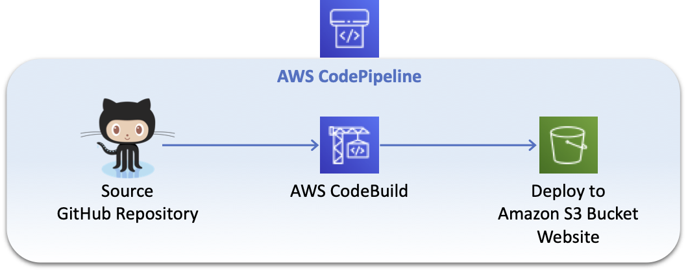

# React application deployment using CodePipeline to Amazon S3



## Create react project and push to git

``` bash
npx create-react-app react-codepipeline-github-to-s3
```

## Create AWS CodePipeline with CloudFormation

Use the cloudformation [cloudformation/codepipeline-github-to-s3.json](cloudformation/codepipeline-github-to-s3.json) to create the stack services.

## Include buildspec.yaml file

``` yaml
version: 0.2
phases:
  install:
    runtime-versions:
      nodejs: latest
    commands:
      - npm install --global yarn
  pre_build:
    commands:
      - node --version
      - yarn --version
      - yarn install
  build:
    commands:
      # Build
      - yarn build
  post_build:
    commands:
      # Post Build
      - ls -la
artifacts:
  base-directory: 'build'
  files:
    - '**/*'
```

## References

Codebuild runtimes: https://docs.aws.amazon.com/codebuild/latest/userguide/runtime-versions.html
Build environment compute types: https://docs.aws.amazon.com/codebuild/latest/userguide/build-env-ref-compute-types.html